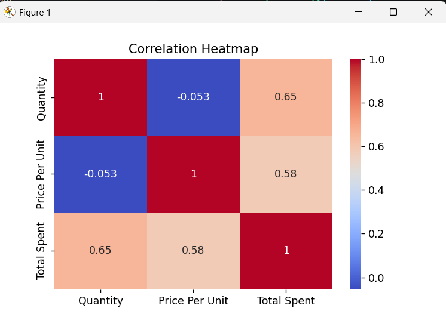
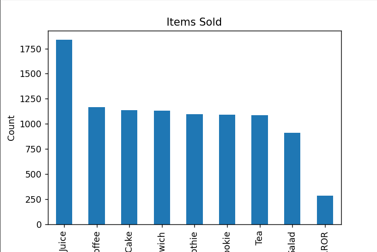
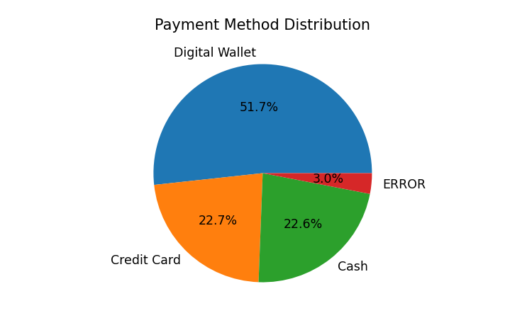

# DataClean Pro: Intelligent Data Cleaning & Analysis System

This project demonstrates a complete data preprocessing and analysis pipeline using Python.

---

## Features
- Handle missing values
- Convert inconsistent data (ERROR, UNKNOWN)
- Remove duplicates
- Detect and remove outliers (IQR method)
- Perform statistical analysis
- Generate visualizations

---

## Data Cleaning Steps
- Converted invalid values (ERROR → NaN)
- Replaced UNKNOWN values
- Filled missing values (mean & mode)
- Removed duplicate records
- Removed outliers using IQR method

---

## Key Insights
- Higher quantity leads to higher total spending
- Price per unit also affects total spending
- Digital Wallet is the most used payment method
- Real-world data contained inconsistencies which were handled

---

## Visual Analysis

### Correlation Heatmap


### Items Sold


### Payment Method Distribution


### Data Cleaning Impact


---

## How to Run
```bash
python main.py
python analysis.py
